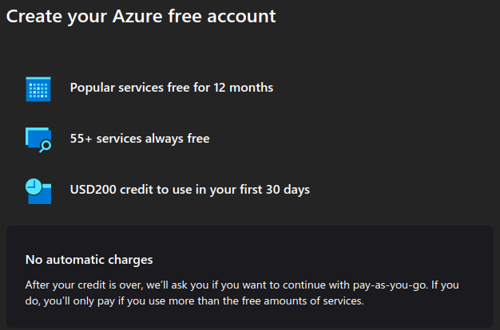
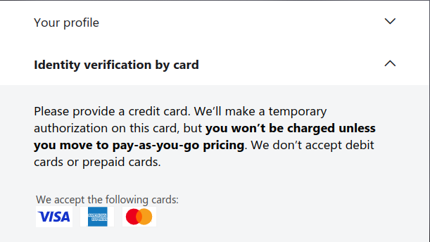
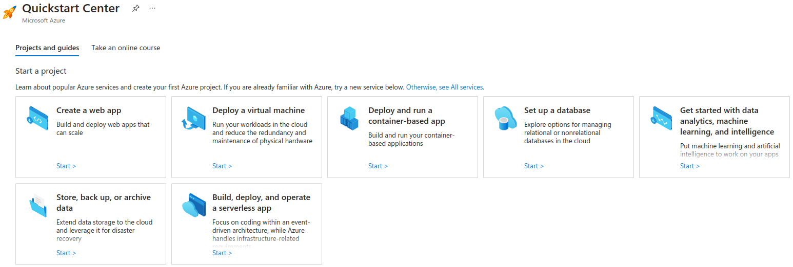
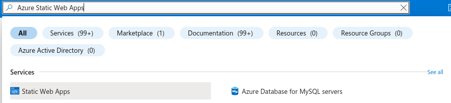
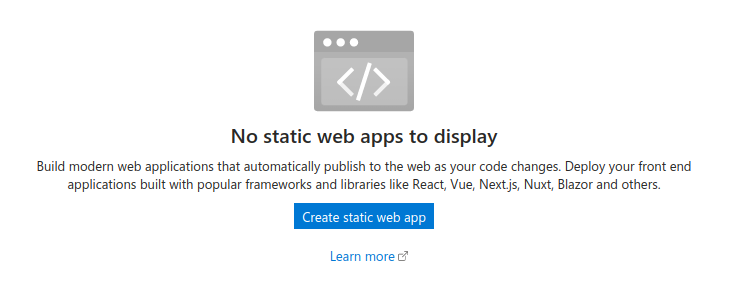
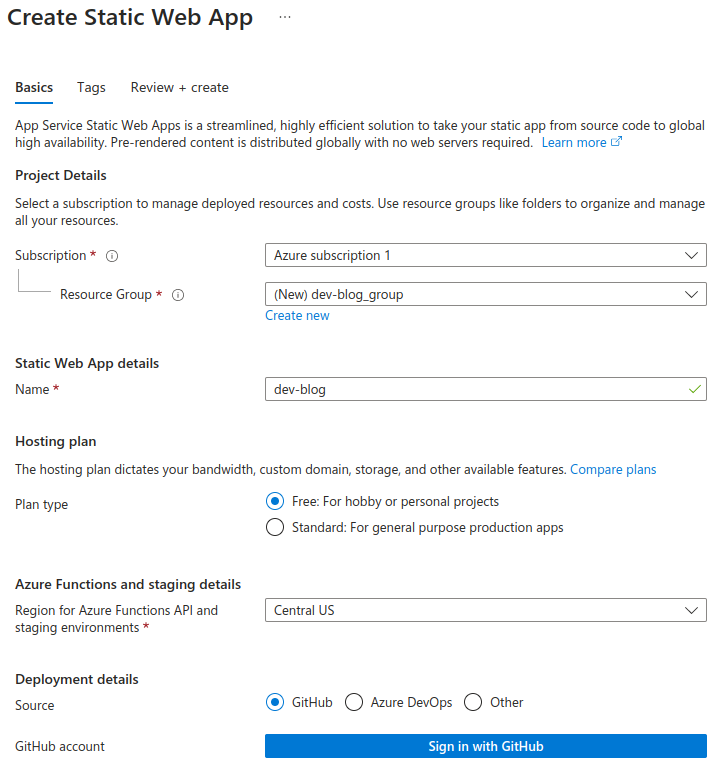
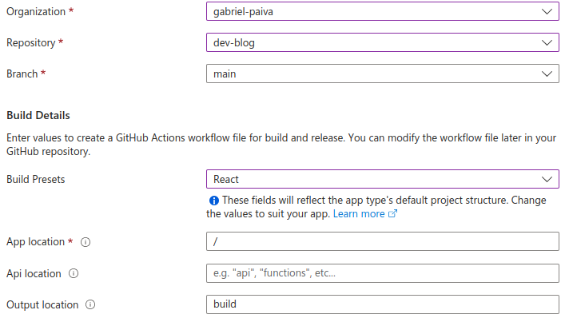

# Construindo um blog com Microsoft Azure

Para construir o seu blog com Docusaurus siga a documentação [clicando aqui](https://docusaurus.io/pt-BR/docs/installation).

Coloque o seu projeto no Github antes de começar a seguir esse tutorial. Caso não saiba, siga esse passo a passo [clicando aqui](https://docs.github.com/pt/get-started/quickstart/create-a-repo).

Esse artigo focará mais no deploy do blog com o Microsoft Azure.

## Criando uma conta gratuita no Microsoft Azure

O Microsoft Azure permite a criação de uma conta gratuita, com a possibilidade de utilizar os serviços populares por 12 meses, com um crédito de $200 que fica disponível por 30 dias. São 27 serviços gratuitos por 12 meses, e mais de 55 serviços que continuam gratuitos para sempre.

Ao se cadastrar no Microsoft Azure ele pedirá informações comuns como nome, telefone e endereço. Também será necessário fazer uma verificação de identidade cadastrando um cartão de crédito, mas isso é só uma medida de segurança do serviço. Nenhum valor será cobrado de imediato, já que a ideia é pagar somente o que for consumido.

Após isso, somos redirecionados a uma tela inicial do Microsoft Azure apresentando os principais serviços que permitem a inicialização de um projeto.

## Fazendo o Deploy com Azure Static Web Apps

Na barra de pesquisa dessa página inicial da Microsoft Azure, vamos pesquisar por “Azure Static Web Apps”, que é o serviço que vamos utilizar para disponibilizar nosso site na nuvem.

:::info O é o Static Web Apps?

O Azure Static Web Apps é um serviço que automatiza o build e o deploy de aplicativos full-stack para a web, conectando um repositório de código à plataforma da Azure. Utilizando esse serviço, o aplicativo pode ser atualizado na nuvem facilmente a cada alteração no código. Isso é possível através da interação direta do Azure com o Github ou Azure DevOps, que monitora o repositório.

O serviço do Static Web Apps é geralmente utilizado para aplicações construídas com frameworks como Angular, React, Svelte, Vue ou Blazor, onde não é necessário fazer renderizações do lado do servidor (SSR). Utilizando um servidor web tradicional, o Static Web Apps é capaz de servir os arquivos (páginas, imagens ou endpoints) para o cliente (navegador).

Esse serviço é distribuido geograficamente ao redor do mundo para prover maior velocidade aos usuários, já que os arquivos ficam fisicamente mais próximos dos clientes.

:::

Na tela inicial do serviço, clique no botão “Criar static web app”.

Na tela a seguir, vamos escolher um nome para nosso Static Web App, o plano Gratuito, mantemos a região como “Central US” e escolhemos fazer o deploy conectando com uma conta do Github.

Após conectar com o Github, o Azure permitirá a escolha de uma organização, repositório e a branch desejada para fazer o deploy. Após isso, devemos detalhar como é o processo de build desse app. Como o nosso blog é construido com Docusaurus, que utiliza React, podemos deixar o build padrão de aplicações React já provido no Azure:

Com tudo configurado, clicamos em “Revisar + Criar”. O Microsoft Azure fará uma verificação do projeto e então habilitará o botão de “Criar”. Clicamos nele para prosseguir. Com isso, se voltarmos ao repositório no Github, vamos perceber que o Azure fez um novo commit (utilizando sua conta conectada) na branch escolhida, adicionando um arquivo que se conecta ao Github Actions.

:::info O é o Github Actions?

GitHub Actions é uma plataforma de integração contínua e entrega contínua (CI/CD) que permite automatizar a compilação, teste e implantação de códigos e aplicativos. É possível criar fluxos de trabalho que criam e testam cada pull request no seu repositório, ou implantar pull requests mesclados em produção.

Os fluxos de trabalho do GitHub Actions contém eventos, trabalhos, executors e actions.

:::

De volta ao Azure, veremos a tela do nosso projeto. Nela, estarão disponíveis vários dados sobre ele, inclusive a URL de acesso. Se tudo der certo, o site já deve estar disponível na nuvem para ser acessado de qualquer lugar do mundo.
